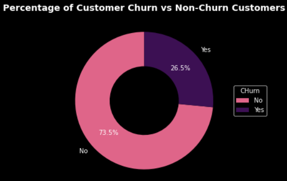
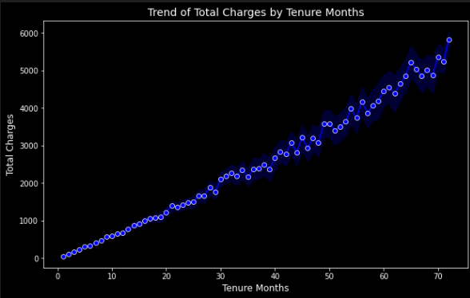
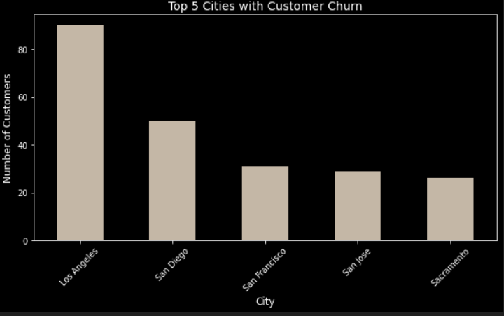
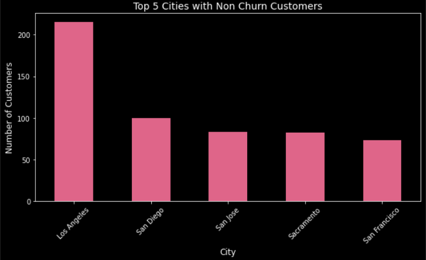
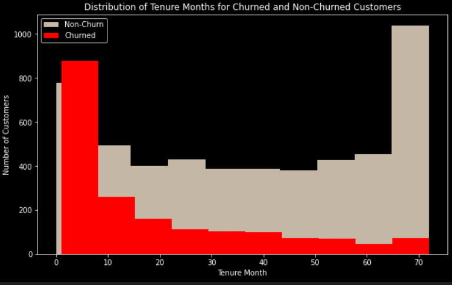

# Hands-On Data Science Project: Data Visualization in Python

## Overview

This project focuses on **data visualization** using Python libraries such as `Matplotlib` and `Seaborn` to gain insights from a customer churn dataset. The goal is to understand the behavior of customers who churn and those who do not churn, and the relationship between tenure months and total charges.

## Objectives
- Perform **bivariate data visualization** to compare churn and non-churn customers.
- Visualize the **distribution of data** such as customer tenure and total charges.
- Create **categorical data visualizations** to identify trends between cities.
- Build **data storytelling** that can explain insights from the data and propose strategies to reduce customer churn.

## Dataset
The dataset contains customer information including churn status, tenure, total charges, and city of residence. You can find the dataset in the `/dataset` folder or [download it here](#).

## Visualizations and Insights

### 1. Churn vs Non-Churn Distribution

- **Most customers (73.5%) are non-churn**, while **26.5%** of customers have churned.
- Churn rates are highest during the **first 10 months**, indicating that the initial period is critical for customer retention.

### 2. Tenure vs Total Charges

- There is a **linear relationship** between **Tenure Months** and **Total Charges**. As customers stay longer with the company, their total charges increase.
- **Customers with longer tenure** tend to spend more, possibly due to **upselling** or **additional services**.

### 3. Churn by City

- **Los Angeles** has the highest churn rate, followed by **San Diego**. This suggests that special attention is needed for these cities, possibly through improved service or customer incentives.
- However, Los Angeles also has a large number of **loyal customers**, showing potential for customer retention in this region.

### 4. Non-Churn by City

- Cities like **Los Angeles** and **San Diego** not only have high churn rates, but they also have the highest number of **non-churned customers**. 
- Understanding the factors that keep these customers loyal can help reduce churn in these cities.

### 5. Persebaran Tenure Months Berdasarkan Churn Label

- **Churned customers tend to have shorter tenures**. Most churned customers leave the company within the **first 10 months** of their subscription.
- **Non-churned customers have a more evenly distributed tenure** cross the entire time range, with peaks in both the early and later months. This indicates that loyal customers either stay for a long period or decide to leave after a significantly extended period.
- **Onboarding and retention strategies** are crucial during the first 10 months, as this is the period where churn is most frequent.

## Insights and Recommendations

1. **Onboarding and Early Retention**:
    - Since churn is highest within the first 10 months, a stronger focus on **customer onboarding** and **initial engagement** is essential. Offering special promotions or improved support during this period could help.

2. **Long-term Customer Value**:
    - Customers with longer tenure tend to have higher total charges, indicating that **loyal customers** are more valuable in the long term. Implementing **loyalty programs** or **premium services** can help maintain these relationships.

3. **City-specific Strategies**:
    - **Los Angeles** and **San Diego** should be the focus of churn reduction strategies, such as targeted offers or improved services, as they have the highest churn rates.
    - At the same time, efforts should be made to retain the large non-churned customer base in these cities.
